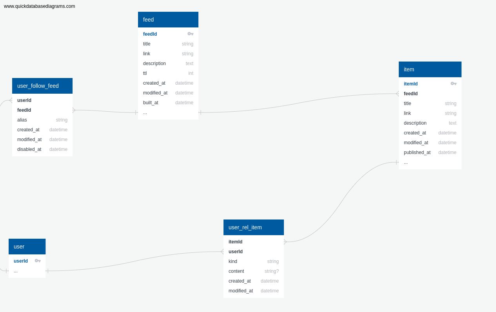

# pyfeedrss

### Installation ###
* Clone the project `git clone git@github.com:nicolasteodosio/pyfeedrss.git`
* Project was created with python 3.7, so create a virtualenv with python 3.7
* I recommend using [pyenv](https://github.com/pyenv/pyenv-installer) and [pyenv-virtualenv](https://github.com/pyenv/pyenv-virtualenv#installation)
* Activate your virtualenv
* [Install the docker](https://docs.docker.com/install/linux/docker-ce/ubuntu/#install-using-the-repository)
* [Install docker-compose](https://docs.docker.com/compose/install/#install-compose)
* At the root of the project run `make install`
* Or run `pip install -r requirements/dev.txt` and `pre-commit install`

### Env files ###
* First you need to create the `.env` files, theres a `.env.example` that you can fill and then run `make create-envs`.
* It will be created 3 `.env` files: 
    * `.env`
    * `.env.dev`
    * `.env.prod`   
* The values in the `.env` are:

| Name                      | Description                                                                   | Required  |
| ------------------------- | ----------------------------------------------------------------------------- | --------- |
| DJANGO_SECRET_KEY         | Django secret key                                                             | YES       |
| DATABASE_URL              | Url for the database connection                                               | YES       |
| DEBUG                     | Run application in debug mode                                                 | NO        |
| DRAMATIQ_BROKER_URL       | Url for worker connection with broker                                         | YES       |
| SENTRY_DSN                | Sentry integration DSN                                                        | NO        |

### Running dev application ###
* There are two ways to run this application for development
* 1:
    * Run `docker-compose up -d`
    * The application will be running at: `http://127.0.0.1:8000`
* 2:
    * Run the `docker-compose up -d postgres redis rabbitmq`
    * If this is your first time, run `python manage.py migrate` or `make run-migrations`
    , so you will have the application tables
    * Finally run `python manage.py runserver` or `make run-server`
    * Application will be running at: `http://localhost:8000`
    * For the workers run `python manage.py rundramatiq` or `make run-workers`

    
### Running the tests ###
* At least `docker-compose postgres` must be running
* To run the tests run `make test`, or `pytest`
* To run with coverage `make converage`, or `pytest -xv --cov=app --cov-report term-missing`

### Application for production ###
* This project is ready for production
* Theres a `Dockerfile.prod`, to create this application docker image.
* The `docker-compose.prod.yml` is an example of the application running in production enviroment
    * It cam be used running the command: `docker-compose -f docker-compose.prod.yml up -d --build`
* This project is using [`django-whitenoise`](http://whitenoise.evans.io/en/stable/index.html) for the static content,
 but the docker-compose file is ready to use nginx if needed.
* This project also has the [`django-storages`](https://django-storages.readthedocs.io/en/latest/)
installed to be able to get static from AWS OR GCP if needed

### Docs ###
* The documentation from this project was built using `sphinx`, get the information from the `docstrings`
* The `docstrings` was built using `Numpy` format.
* Any commit in the `master` branch, the docs is updated and can be found in 
[docs](https://pyfeedrss.readthedocs.io/en/latest)

### Comments ###
* Orignally the project's database design was thought with the following structure:
    
    * With the addition of the `Notification` table, afterwards. 
* The application is using [pre-commit](https://pre-commit.com/) git hooks, with `black`, `flake8`, `isort`.
* The test coverage of the application can be see at: [COVERAGE](https://coveralls.io/github/nicolasteodosio/pyfeedrss) 
* This application has integration ready with [SENTRY](https://sentry.io), so any exception will be logged in the tool.
* The application also has a `CI` using [TRAVIS](https://travis-ci.org/), which can be found at [https://travis-ci.org/github/nicolasteodosio/pyfeedrss](https://travis-ci.org/github/nicolasteodosio/pyfeedrss).

### Backlog ###

* Look at the [Dramatiq pipelines](https://dramatiq.io/cookbook.html#pipelines)
* Would use [bandit](https://github.com/PyCQA/bandit) for security check
* Add the project to [SonarQube](https://www.sonarqube.org/), to track code smells, bugs etc.
* I would pay more attention to django admin, I just did some simple ones.
* I would like to make an API using [DRF](https://www.django-rest-framework.org/)
* Make the Continuos Delivery to deploy automatically when the application  receive a commit at the master branch 